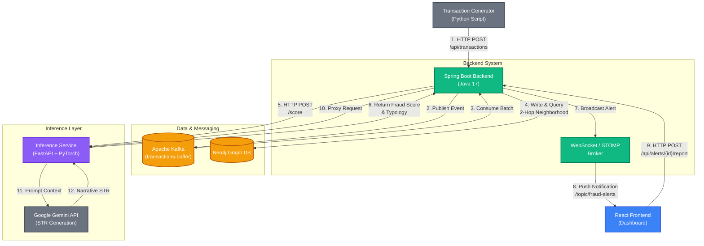

# FinTrace: AML Fraud Detection System

FinTrace is a full-stack AML fraud detection application demonstrating real-time transaction processing, graph analytics, ML inference, and reporting.

## What this project does

- Ingests synthetic financial transactions
- Streams events through Kafka
- Stores a graph representation in Neo4j
- Scores suspicious subgraphs with a Graph Neural Network
- Surfaces alerts and evidence in a React dashboard
- Generates structured reports using AI-assisted text generation

## Tech stack

- Java 17 + Spring Boot
- React 18 + Vite
- Python FastAPI + PyTorch
- Kafka + Zookeeper
- Neo4j graph database
- Docker Compose

## Architecture

### Key components

- **Transaction Generator** (`transaction/transaction_generator.py`)
  - Sends synthetic transactions to the backend over HTTP
  - Creates both legitimate and suspicious fund movement patterns
  - Used for demo/testing and validating the full pipeline

- **Backend** (`backend/backend/`)
  - Java Spring Boot application
  - Receives transaction events on `POST /api/transactions`
  - Uses Kafka as a buffering and batching layer
  - Stores transactions and graph data in Neo4j
  - Calls the Python inference service for fraud scoring
  - Publishes alerts in real time to the frontend via WebSocket

- **Kafka / Zookeeper**
  - Kafka topic `transactions-buffer` holds incoming transactions
  - Backend produces transactions into Kafka and also consumes them
  - This isolates ingestion from processing and enables batching

- **Neo4j**
  - Graph database for accounts, transactions, and relationships
  - Backend writes new account and edge data here
  - Backend queries 2-hop neighborhoods for inference input
  - Backend updates fraud labels after scoring

- **Inference Service** (`inference/inference_service.py`)
  - Python FastAPI microservice
  - Loads the GNN model (`best_model1.pt`)
  - Exposes `/score` for scoring transaction subgraphs
  - Exposes `/report` for generating investigative STR text
  - Called by the backend via REST

- **Frontend** (`frontend/`)
  - React + Vite dashboard
  - Connects to backend WebSocket endpoint `/ws` using STOMP
  - Subscribes to `/topic/fraud-alerts`
  - Displays live alert cards, risk score details, and report buttons


### System diagram



### Detailed request flow

1. **Transaction submit**
   - The generator posts a transaction JSON to `POST /api/transactions`.
   - Backend receives the transaction in `TransactionController.receiveTransaction()`.

2. **Kafka buffering**
   - Backend publishes the transaction to Kafka topic `transactions-buffer`.
   - Kafka stores the transaction until the backend consumer reads it.
   - This makes ingestion resilient and supports bursty traffic.

3. **Batch persistence**
   - The backend consumes the same Kafka topic via `@KafkaListener`.
   - Transactions are buffered in memory inside `TransactionService`.
   - Every 5 seconds or when 25 transactions are buffered, the backend flushes them to Neo4j.

4. **Neo4j graph update**
   - New accounts and transaction edges are stored in Neo4j.
   - If the same transaction already exists, duplicates are skipped.
   - Neo4j becomes the authoritative source for account relationships.

5. **Neighborhood retrieval**
   - For each stored transaction, the backend queries Neo4j for the 2-hop transaction neighborhood.
   - This returns related accounts and transaction edges around the trigger event.
   - If the transaction is isolated, the backend creates a minimal trigger-only graph.

6. **Inference scoring**
   - The backend builds a `ScoreRequest` with nodes and edges.
   - It calls the inference service at `/score`.
   - The inference service runs the GNN model and returns:
     - fraud score
     - typology label
     - risk level
     - evidence steps
     - graph visualization payload
     - latency and confidence

7. **Result update**
   - Backend updates Neo4j with the fraud decision for the trigger transaction.
   - It also stores an in-memory list of recent alerts for the frontend and HTTP fallback.

8. **Frontend notification**
   - Backend broadcasts the alert on `/topic/fraud-alerts` using `SimpMessagingTemplate`.
   - The frontend receives the alert instantly and updates the UI.
   - The frontend also uses `/api/alerts` as a polling/fallback endpoint for recent alerts.

9. **Report generation**
   - When a user clicks generate report, frontend calls `POST /api/alerts/{id}/report`.
   - Backend forwards the request to the inference service `/report`.
   - The inference service returns a human-readable STR-style narrative.

### What happens where

- **Transaction generator**: creates the input events.
- **Backend**: orchestration, persistence, graph queries, buffering, WebSocket delivery.
- **Kafka**: temporary durable queue and buffer layer.
- **Neo4j**: graph storage and neighborhood analysis.
- **Inference service**: ML scoring and report generation.
- **Frontend**: user-facing visualization, live alerts, and report request UI.

### Why this architecture works

- **Decoupling**: Kafka decouples ingestion from analysis.
- **Batching**: the backend batches writes to Neo4j for efficiency.
- **Graph analytics**: Neo4j provides relationship context for every transaction.
- **Service separation**: ML inference is isolated in Python, so the backend remains lightweight.
- **Real-time UX**: WebSocket updates let the dashboard refresh immediately when alerts appear.

### Actual endpoints used

- `POST /api/transactions` — ingest transaction events
- `GET /api/alerts` — retrieve recent fraud alerts
- `POST /api/alerts/{transactionId}/report` — request STR report generation
- `/ws` — STOMP websocket endpoint for live alert push
- `/topic/fraud-alerts` — subscription channel for new alerts

### Naming and service mapping

- `backend/backend/src/main/java/com/aml/controller/TransactionController.java`
  - receives transaction HTTP POST
- `backend/backend/src/main/java/com/aml/service/TransactionService.java`
  - buffers, flushes to Neo4j, runs analysis, broadcasts alerts
- `backend/backend/src/main/java/com/aml/service/InferenceService.java`
  - calls Python inference endpoints
- `backend/backend/src/main/java/com/aml/config/WebSocketConfig.java`
  - configures `/ws` and `/topic/fraud-alerts`
- `inference/inference_service.py`
  - exposes `/score` and `/report`

This ensures the architecture description is aligned with the actual implementation and shows exactly where each piece of logic lives.
From repository root:

```powershell
docker compose up --build
```

Open in browser:
- Frontend: `http://localhost:5173`
- Backend API: `http://localhost:8080`
- Neo4j Browser: `http://localhost:7474`
- Inference API: `http://localhost:8000`

### Run the Transaction Generator (On-Demand)
Wait a few seconds for the core infrastructure (like Kafka and Spring Boot) to fully boot up, then trigger the generator in a new terminal window.

For automated demo mode (continuous stream):
```powershell
docker compose run --rm transaction-generator python transaction_generator.py --mode auto
```

For interactive manual mode (live demonstrations):
```powershell
docker compose run --rm transaction-generator python transaction_generator.py --mode manual
```

### Stop the stack

```powershell
docker compose down
```
Note: If you ever need to completely wipe the Neo4j database and start fresh, run docker compose down -v to destroy the persistent volumes.

## Local development

### Frontend
```powershell
cd frontend
npm install
npm run dev
```

### Backend
```powershell
cd backend\backend
./mvnw spring-boot:run
```

### Inference
```powershell
cd inference
pip install -r requirements.txt
python inference_service.py
```

### Transaction generator
```powershell
cd transaction
python transaction_generator.py --mode auto
```

## Clean repository guidance

Remove or ignore generated artifacts before pushing:
- `backend/backend/target/`
- `backend/.idea/`
- `inference/__pycache__/`
- `inference/inference/`
- `transaction/transaction/`
- root `package-lock.json` if there is no root `package.json`
- local `.env` files and logs

## Added files for Dockerization

- `docker-compose.yml` — full stack orchestration
- `backend/backend/Dockerfile` — Java service container
- `frontend/Dockerfile` — React production container
- `inference/Dockerfile` — Python inference container
- `transaction/Dockerfile` — optional transaction generator container
- `.gitignore` — root-level ignore rules

## Notes for reviewers

- The backend now reads service endpoints from environment variables if provided.
- The project supports a full Dockerized deployment path.
- The inference service is designed as an independent service to keep ML separate from the API layer.

│   │   ├── pom.xml                      # Maven dependencies
│   │   ├── mvnw / mvnw.cmd              # Maven wrapper
│   │   └── src/main/java/com/aml/
│   │       ├── controller/              # REST endpoints
│   │       ├── service/                 # Business logic
│   │       ├── model/                   # Data models
│   │       ├── repository/              # Neo4j queries
│   │       └── config/                  # WebSocket config
│   └── src/main/resources/
│       └── application.properties       # Configuration
│
├── frontend/                             # React + Vite
│   ├── src/
│   │   ├── App.jsx                      # Main dashboard
│   │   └── main.jsx                     # Entry point
│   ├── package.json                     # Dependencies
│   ├── vite.config.js                   # Vite config
│   └── styles.css                       # Styling
│
├── inference/                            # Python ML Service
│   ├── inference_service.py             # FastAPI application
│   ├── best_model1.pt                   # Trained PyTorch model
│   ├── requirements.txt                 # Python packages
│   ├── .env.example                     # Template for .env
│   └── .env                             # ⚠️ CREATE THIS (add API key)
│
├── transaction/                          # Test Data Generator
│   ├── transaction_generator.py         # Generates test transactions
│   └── requirements.txt
│
├── README.md                            # This file
```

---

## 🔐 Security Notes

### Development Environment
- Neo4j default password: `neo4j1234` (change in production)
- CORS: Allows all origins (development only)
- No authentication required (add in production)

### For Production
- [ ] Change Neo4j credentials
- [ ] Implement JWT authentication
- [ ] Enable HTTPS/TLS
- [ ] Set CORS restrictions
- [ ] Use API keys for Gemini service
- [ ] Add input validation & sanitization
- [ ] Implement audit logging

---

## 🤝 Contributing

This is a demonstration system. For production use:

1. Add comprehensive error handling
2. Implement authentication & authorization
3. Add unit & integration tests
4. Set up CI/CD pipeline
5. Configure monitoring & alerting
6. Implement database backup strategy
7. Train the model on a better dataset which contains real world noise too for a better model which can work as it should in real world
8. Use Stronger model architectures like TGN or ATGAT 

---

## 📄 License

Educational/Demo Project

---

## 👨‍💻 Tech Stack

| Layer | Technology | Purpose |
|-------|-----------|---------|
| **Frontend** | React 18, Vite 5, Tailwind CSS | Dashboard UI |
| **Backend** | Spring Boot 3.5, Spring WebSocket | REST APIs & real-time messaging |
| **Database** | Neo4j 5.14 | Graph database for account relationships |
| **Message Queue** | Kafka 7.5 | Transaction streaming |
| **ML/AI** | PyTorch, GNN (torch-geometric) | Fraud detection model |
| **LLM** | Google Gemini API | Report generation |
| **Infrastructure** | Docker, Docker Compose | Containerization |

